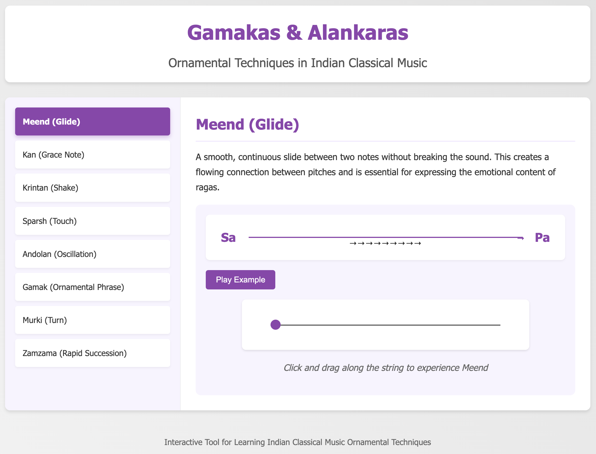

# Indian Classical Music Ornamental Techniques

An interactive web application that demonstrates the fundamental ornamental techniques (gamakas/alankaras) used in Indian classical music.

## Features

- Interactive demonstrations of 8 key ornamental techniques:
  - **Meend (Glide)**: A smooth, continuous slide between two notes
  - **Kan (Grace Note)**: A quick, light touch of an adjacent note
  - **Krintan (Shake)**: A rapid oscillation or vibrato on a single note
  - **Sparsh (Touch)**: A brief, gentle touching of a note
  - **Andolan (Oscillation)**: A controlled wavering between two adjacent notes
  - **Gamak (Ornamental Phrase)**: Complex melodic phrases that embellish the basic structure
  - **Murki (Turn)**: Quick decorative runs or turns around a main note
  - **Zamzama (Rapid Succession)**: Fast alternation between notes

- Visual representations of each technique
- Audio examples using the Tone.js library
- Interactive elements to experience each technique

## How to Use

1. Clone this repository
2. Navigate to the project directory
3. Run the server: `python server.py`
4. Open your browser and go to `http://localhost:54330`
5. Click on different techniques in the left sidebar to explore them
6. Use the interactive elements to experience each technique
7. Click "Play Example" to hear an audio demonstration

## Technologies Used

- HTML5
- CSS3
- JavaScript
- Tone.js for audio synthesis
- Python for the web server

## License

MIT
